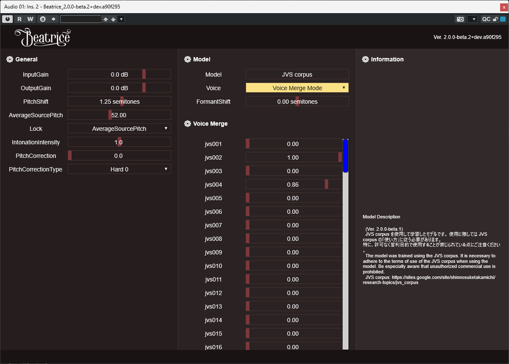

# Beatrice VST

[Beatrice 2](https://prj-beatrice.com) の ~~公式~~ 私家版 VST です。

# 公式からの変更点

## Voice Merge Mode

- モデルに含まれる voice 同士を混ぜ合わせる Voice Merge Mode を実装しました。
  - Voice の項目の末尾に "Voice Merge Mode" という項目を追加しており、
  それを選択するとその下の Voice Merge 欄の各 Voice ごとのスライダーの値に従って
  加重平均を取ったパラメータを使用して音声変換するようになります。
    - 実装的には、 parameter_core の中の speaker_embeddings_ の値を加重平均してます。
    - なお、モデルの中に 256個(最大値)の声が含まれている場合は
    実装の都合上 "Voice Merge Mode" を入れる隙間がなかったので使用できません。(未確認)
      

# How to build

## System requirements

- Windows
  - MSVC 2022
  - CMake >= 3.19

## build steps

- 基本的には Makefile を使用すれば良いものと思われる。
  - 以下、コマンドプロンプトを用いて手作業で行う場合。
  - コマンドライン下記コマンドで、beatrice.lib をダウンロード
    ```cmd
    curl -fLo lib/beatricelib/beatrice.lib https://huggingface.co/fierce-cats/beatrice-2.0.0-alpha/resolve/beta.1/beta.1/beatrice.lib
    ```
  - ビルド用ディレクトリの作成
    ```cmd
    mkdir build
    ```
  - cmake の実行
    ```cmd
    cd build
    cmake .. -DSMTG_USE_STATIC_CRT=ON
    ```
  - ビルドの実行
    ```cmd
    REM cd build
    cmake --build . --config=Release
    ```
  - cmakeによるビルドを実行すると、ユーザーのホームディレクトリ(%USERPROFILE%)以下の "\AppData\Local\Programs\Common\VST3" フォルダにビルドしたファイルへのシンボリックリンクが作成される。

## Trouble shooting

### Debug ビルドが出来ない
- 現状、公式から公開されている beatrice.lib が Release ビルドされているものなので、Debug ビルドは出来ない模様。

### CMake でのビルド後に "EXEC : CMake error : failed to create symbolic link" というエラーが出る
- 作業しているユーザーにシンボリックリンクを作成する権限が与えられていないのが原因。
  - 「グループポリシーの編集」から 「コンピューターの構成」→ 「Windowsの設定」→「セキュリティの設定」→「ローカル ポリシー」→「ユーザー権利の割り当て」→「シンボリックリンクの作成」 に適切なユーザー名を設定し、PCを再起動。